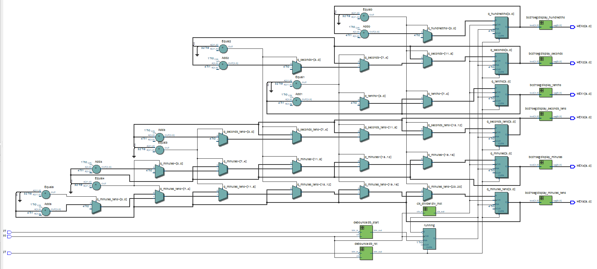

# CHRONOMETER_VERILOG_FPGA
chronometer built in Verilog and implemented on a DE0-CV FPGA. It features a reset button and a start/stop button for controlling the timer.

The chronometer is composed of four files: **clk_divider.v, bcd7seg.v, debounce.v and cronometro_top.v** \
In this README file you will find a detailed explanation of each file, which ones could be found in this repository. The RTL diagram and the black box model could be found in the files of these repository.




# clk_divider.v

This module implements a clock divider in Verilog. The primary purpose of this module is to take an input clock signal (`clk_in`) and generate an output clock signal (`clk_out`) that has a lower frequency, determined by the `DIVISOR` parameter.

## Verilog Code
```verilog
module clk_divider #(parameter DIVISOR = 50000000) (
    input clk_in,
    output reg clk_out = 0
);
    reg [31:0] counter = 0;
    
    always @(posedge clk_in) begin
        if(counter == DIVISOR/2 - 1) begin
            clk_out <= ~clk_out;
            counter <= 0;
        end else begin
            counter <= counter + 1;
        end
    end
endmodule
```

## Explanation

### **Parameters and Ports**
`DIVISOR`: This parameter determines the frequency division factor. The default value is `50000000`.due to this is the original clock frequency of the FPGA where the chronometer was implemented.
`clk_in`: Input clock signal.
`clk_out`: Output clock signal with a divided frequency.

### **Internal Signals**
`counter`: A 32-bit register that counts the number of clock cycles.

### **Working Mechanism**
**Counting Clock Cycles**\
   The `always` block triggers on the rising edge (`posedge`) of `clk_in`.
   `counter` increments with every clock cycle of `clk_in`.

 **Clock Toggling**\
    When `counter` reaches `DIVISOR/2 - 1`, `clk_out` toggles (flips its state from 0 to 1 or from 1 to 0).\
   The counter resets to 0 after toggling.
   This ensures that `clk_out` completes one full cycle (both high and low) after `DIVISOR` clock cycles of `clk_in`, effectively reducing the frequency by a factor of `DIVISOR`.
   

# bcd7seg.v

This Verilog module converts a 4-bit Binary-Coded Decimal (BCD) input into a 7-segment display output. This code will be used every time that is needed to show a number on the FPGA's 7 segment displays

## Verilog Code
```verilog
module bcd7seg(
    input  [3:0] bcd,
    output reg [6:0] seg
);

always @(*) begin
    case(bcd)
        4'd0: seg = 7'b1000000;  // 0
        4'd1: seg = 7'b1111001;  // 1
        4'd2: seg = 7'b0100100;  // 2
        4'd3: seg = 7'b0110000;  // 3
        4'd4: seg = 7'b0011001;  // 4
        4'd5: seg = 7'b0010010;  // 5
        4'd6: seg = 7'b0000010;  // 6
        4'd7: seg = 7'b1111000;  // 7
        4'd8: seg = 7'b0000000;  // 8
        4'd9: seg = 7'b0010000;  // 9
        default: seg = 7'b1111111; // Off if values are greater than 9
    endcase
end

endmodule
```


### **Inputs and Outputs**
 **`bcd`**: A 4-bit input representing a decimal number (0-9).\
**`seg`**: A 7-bit output controlling a 7-segment display.

### **Segment Encoding**
Each case in the `case` statement maps a BCD digit to its corresponding 7-segment representation.
`1` means segment OFF, `0` means segment ON.

### **Default Case**
If `bcd` is greater than 9, `seg` is set to `7'b1111111`, turning off all segments.

***

### it is possible to build a chronometer using only the clock divider and the BCD to seven segment code implemented on a top file. But in some devices this is not a good idea. Due to sometimes the toggle of buttons is not read correctly, this was a problem present in the first stage of this project. Thus, a debounce file was implemented in order to resolve this issue.
---

# debounce.v
This Verilog module implements a debounce circuit for a push button. When a mechanical button is pressed or released, it often generates multiple transitions (bounces) before settling to a stable state. This module ensures that only a single, stable transition is registered.

## Verilog Code
```verilog
module debounce(
    input wire clk,
    input wire btn_in,
    output reg btn_out  
);

    reg [19:0] count = 0;
    reg stable_state = 1'b1;

    always @(posedge clk) begin
        if (btn_in != stable_state) begin
            count <= count + 1;
            if (count == 20'hFFFFF) begin
                stable_state <= btn_in;
                count <= 0;
            end
        end else
            count <= 0;

        btn_out <= stable_state;
    end

endmodule
```

## Explanation

### **Inputs and Outputs**
 **`clk`**: Clock signal used to synchronize the debounce process.
 **`btn_in`**: Raw input signal from the push button.\
**`btn_out`**: Debounced button output.

### **Debounce Mechanism**
**Detects State Change**:
     If `btn_in` differs from the `stable_state`, the `count` starts incrementing
   
**Waiting for Stability**:
   If `btn_in` remains in the new state for `20'hFFFFF` cycles, `stable_state` updates.
   If `btn_in` changes again before `count` reaches the threshold, `count` resets

**Output Update**:
   The debounced button state (`stable_state`) is assigned to `btn_out`.

***
### Finally, with these three files the top file could be built as follows

# chronometer_top

This Verilog module implements a **digital stopwatch** that counts time in **minutes, seconds, tenths, and hundredths of a second**. It utilizes the three previously presented modules.

This stopwatch can be controlled using two buttons:\
**START/STOP button**: Toggles the running state of the stopwatch.\
**RESET button**: Resets the time to zero.

## Verilog Code
```verilog
module cronometro_top(
    input wire CLOCK_50,  // 50 MHz clock
    input wire RST,       // Reset button (active low)
    input wire START,     // Start/Stop button (active low)
    output wire [6:0] HEX0, // Hundredths of a second
    output wire [6:0] HEX1, // Tenths of a second
    output wire [6:0] HEX2, // Seconds (units)
    output wire [6:0] HEX3, // Seconds (tens)
    output wire [6:0] HEX4, // Minutes (units)
    output wire [6:0] HEX5  // Minutes (tens)
);
```
### **Inputs and Outputs**
`CLOCK_50`: A **50 MHz clock** that drives the entire system.\
`RST`: A **reset button** (active-low) that resets the timer.\
`START`: A **start/stop button** (active-low) that toggles the running state of the stopwatch.\
`HEX0-HEX5`: **7-segment display outputs**, showing the stopwatch's time in hundredths of a second, tenths, seconds, and minutes.

---
## **Debounce Logic for Buttons**
Mechanical switches exhibit **bouncing**, causing unintended rapid transitions between states. The **debounce module** stabilizes these signals.
```verilog
wire rst_db, start_db;

// Instantiate the debounce module
debounce db_rst (.clk(CLOCK_50), .btn_in(~RST), .btn_out(rst_db));
debounce db_start (.clk(CLOCK_50), .btn_in(~START), .btn_out(start_db));
```

The `debounce` module ensures the `RST` and `START` signals remain stable.\
The input signals are **negated (`~RST`, `~START`)** because the buttons are active-low.\
 The output (`rst_db`, `start_db`) provides a clean, stable signal to control the stopwatch.

---
## **Clock Division for Timer Counting**
The stopwatch counts **hundredths of a second**, requiring a **slower clock** derived from the 50 MHz system clock.
```verilog
clk_divider #(.DIVISOR(500000)) div_inst (
    .clk_in(CLOCK_50),
    .clk_out(slow_clk)
);
```

The **clock divider** reduces the 50 MHz clock to **100 Hz** (one tick per centisecond).\
**500,000 cycles** at 50 MHz correspond to **10 ms per tick** (hundredths of a second).

---
## **Start/Stop Logic**
The `START` button toggles whether the stopwatch runs or pauses.
```verilog
always @(posedge CLOCK_50 or posedge rst_db) begin
    if (rst_db)
        running <= 0; // Reset: stop counting
    else if (start_db)
        running <= ~running; // Toggle Start/Stop
end
```
If `rst_db` is **high** (reset button pressed), the stopwatch stops (`running = 0`).\
If `start_db` is **pressed**, `running` **toggles** (on/off state changes).\
Ensures the stopwatch **remembers** whether it was running before reset.

---
## **Time Counting Logic**
The core logic **increments the timer** at every `slow_clk` tick (100 Hz).
```verilog
always @(posedge slow_clk or posedge rst_db) begin
    if (rst_db) begin
        q_hundredths <= 0;
        q_tenths <= 0;
        q_seconds <= 0;
        q_seconds_tens <= 0;
        q_minutes <= 0;
        q_minutes_tens <= 0;
    end else if (running) begin
        q_hundredths <= q_hundredths + 1;
        if (q_hundredths == 9) begin
            q_hundredths <= 0;
            q_tenths <= q_tenths + 1;
```
**When `running` is enabled**, the stopwatch **increments hundredths of a second (`q_hundredths`)**.\
**Carries over** to tenths (`q_tenths`), seconds (`q_seconds`), and minutes (`q_minutes`) accordingly.\
**Resets when `rst_db` is pressed.**

---
## **Displaying Time on 7-Segment Display**
The `bcd7seg` module converts BCD values to signals that drive **7-segment displays**.
```verilog
bcd7seg display_hundredths (.bcd(q_hundredths), .seg(HEX0));
bcd7seg display_tenths    (.bcd(q_tenths),    .seg(HEX1));
bcd7seg display_seconds   (.bcd(q_seconds),   .seg(HEX2));
bcd7seg display_seconds_tens (.bcd(q_seconds_tens), .seg(HEX3));
bcd7seg display_minutes    (.bcd(q_minutes),    .seg(HEX4));
bcd7seg display_minutes_tens (.bcd(q_minutes_tens), .seg(HEX5));
```

**Each digit (`q_*`) is converted** into a 7-segment display format.
`HEX0-HEX5` displays time as **MM:SS:DD** (minutes, seconds, centiseconds).

# Simulation and physical implementation

